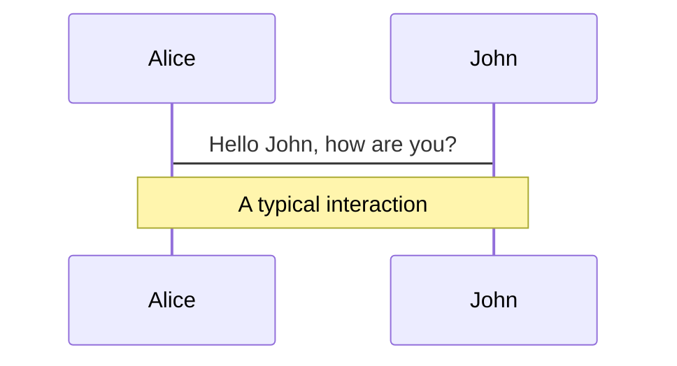
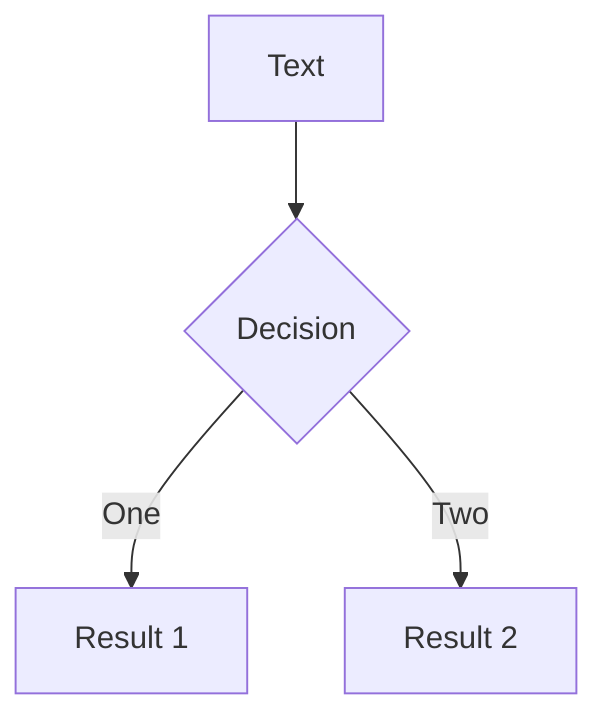
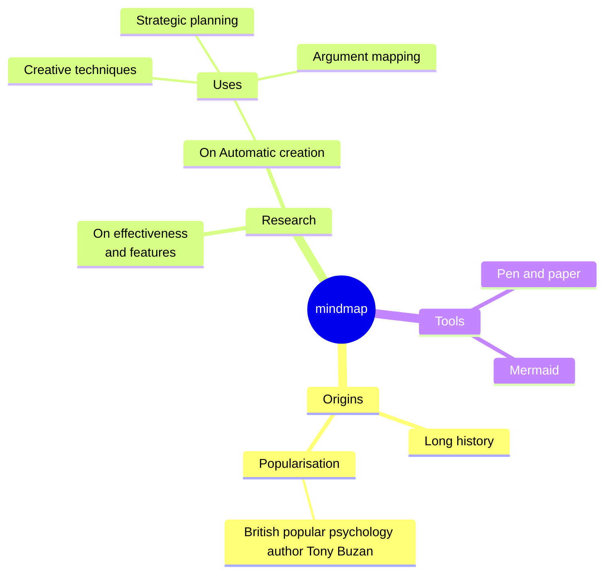
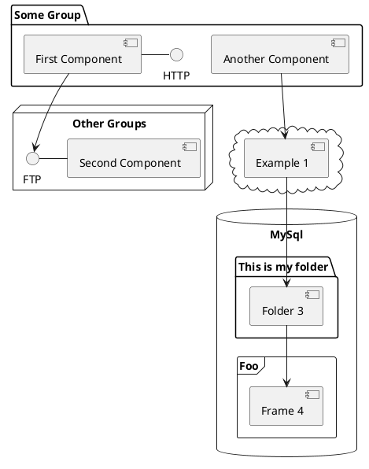

# Diagrams

You can create diagrams / graphs from textual descriptions, directly in your Markdown.

<!--
DIAGRAM TYPES
--------------
Slidev supports Mermaid and PlantUML out of the box.

─── MERMAID ───────────────────────────────────────────────────────────────────

Basic usage:
  ```mermaid
  graph TD
  A[Start] --> B[End]
  ```

Options object (after the language tag):
  ```mermaid {scale: 0.8, alt: 'Description for accessibility', theme: 'neutral'}

  scale  → zoom factor (0.5 = half size, 1 = full, 1.5 = 150%)
  alt    → alt text rendered for the image
  theme  → 'default' | 'neutral' | 'dark' | 'forest' | 'base'

MERMAID DIAGRAM TYPES (most common):
  graph TD / graph LR   → flowchart (TD = top-down, LR = left-right)
  sequenceDiagram       → sequence / interaction diagrams
  classDiagram          → UML class diagrams
  stateDiagram-v2       → state machines
  erDiagram             → entity-relationship diagrams
  gantt                 → project timelines
  pie                   → pie charts
  mindmap               → mind maps (as used below)
  journey               → user journey maps
  gitGraph              → git branching history

  Full reference: https://mermaid.js.org/intro/

─── PLANTUML ──────────────────────────────────────────────────────────────────

  ```plantuml {scale: 0.7}
  @startuml
  ...
  @enduml
  ```

  scale option works the same as Mermaid.
  PlantUML requires a remote rendering server by default; configure in vite.config.ts
  under the plantuml.server key, e.g. https://www.plantuml.com/plantuml

  PlantUML diagram types:
    @startuml / @enduml       → sequence, class, component, deployment, activity, state, usecase
    @startmindmap / @endmindmap
    @startwbs / @endwbs       → work breakdown structure
    @startgantt / @endgantt

  Full reference: https://plantuml.com/
-->

<div class="grid grid-cols-4 gap-5 pt-4 -mb-6">









</div>

Learn more: [Mermaid Diagrams](https://sli.dev/features/mermaid) and [PlantUML Diagrams](https://sli.dev/features/plantuml)
